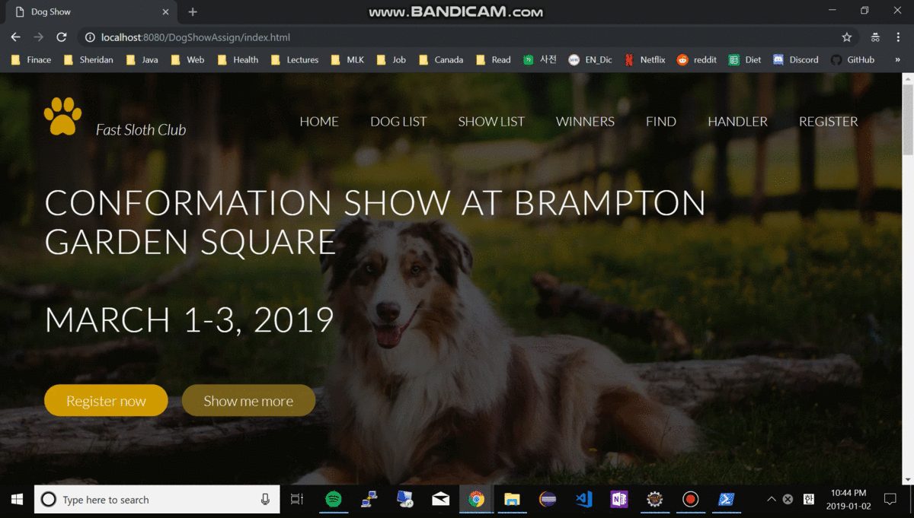

# Conformation show

# Overview

A conformation show, also referred to as a breed show, is a kind of dog show in which a judge familiar with a specific dog breed evaluates individual purebred dogs for how well the dogs conform to the extabilished breed type for their breed, as described in a breed's individual breed standard. (From Wikipedia)

# Purpose

I created an online registration page which will allow a person to register their dog or dogs, and display information about the show.

# Dog information

Class: Dog vs Specialty Dog

Breed: Each dog will belong to a specific breed

Groups: Breeds are collected into groups  
&nbsp; &nbsp; Group 1, Sporting Dogs
&nbsp; &nbsp; Group 2, Hounds
&nbsp; &nbsp; Group 3, Working Dogs
&nbsp; &nbsp; Group 4, Terriers
&nbsp; &nbsp; Group 5, Toys
&nbsp; &nbsp; Group 6, Non-Sporting
&nbsp; &nbsp; Group 7, Herding

# Fuctionalities:

1. Add dog information:  
&nbsp; &nbsp; * Entry Number (Auto generated and unique)
&nbsp; &nbsp; * Name
&nbsp; &nbsp; * Owner name
&nbsp; &nbsp; * Breed
&nbsp; &nbsp; * Group (Must be one of the 7 groups listed)
&nbsp; &nbsp; * Gender (Male/Female)
&nbsp; &nbsp; * Class or Specialty

2.  Edit and Delete:  
    Be able to edit and delete dogs from the dog show

3. Email:  
    Add an email to the dog registration page.  When someone registers their dog, send an email to the email address entered that confirms that they added their dog successfully in the body of the email, and provide all of the details they entered in the body of the email also.

4. Dog Handlers:  
    Sometimes dog owners will hire handlers to show their dogs for them.  Create Tomcat security for your website.  Your users will be dog handlers.  When a dog handler logs in they should be able to add and view dogs in a personal list for themselves (The dogs they will show).   The entire web application is not under security, only the pages relevant to the dog handler.

5. Add Shows:  
    Dog shows will usually occur in groups over a weekend.  
    Choose 3 days over a Friday-Sunday in March of 2019 to host the dog show.  When a dog is registered, they should be able to choose one, two, or three shows to attend.  When showing the dogs, include what days the dogs will be attending.  Note:  When a dog is registered, they keep the same number during all 3 shows.  It would not be making different numbers for each day.

6. Display Individual Shows:  
    It be able to select which of your 3 days to display.  Format the output so that it has the date of the show at the top of the page, and the page is nicely formatted to print.

7. Handlers:  
    If you are logged in as a handler, be able to select one of the 3 days and show the dogs that are registered for that day to show.

**The website works best in Chrome.
## How to run:  
Use the following credentials to log in:  

Handler name: Kyle
Password: notReal

To make dummy dogs:
 
Click "Register" to go to the register page (Day 1) which also has a "Create Dummy" button.

Add the following roles to your tomcat-users.xml file on the server:

	<role rolename="Member"/>
	<role rolename="Handler"/>
	<user username="Member" password="notReal" roles="Member"/>
	<user username="Handler" password="notReal" roles="Handler"/>
	<user username="George" password="notReal" roles="Member"/>
	<user username="Kyle" password="notReal" roles="Handler"/>

